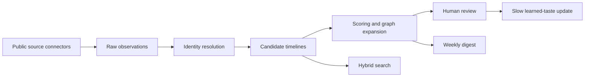

# Unfound

Unfound is a gated internal workspace for reviewing source-linked evidence about potential candidates. It collects permitted public signals, keeps same-name identities separate until they can be resolved, ranks meaningful changes, and prepares a weekly review brief.

The operating question is simple: who became more interesting this week, and what public evidence supports that judgment?

## What is included

- Scheduled discovery plus a continuous, lease-backed research worker with bounded retries, provenance, and deduplication
- Candidate dossiers that preserve raw evidence, normalized events, identity confidence, and graph relationships
- Explainable scoring across achievement quality, trajectory velocity, originality, trusted-network proximity, evidence diversity, and earlyness
- Supabase Postgres plus `pgvector` for durable storage, hybrid retrieval, and similarity search
- A private dashboard for review, semantic search, criteria tuning, source controls, digest recipients, and learned-taste feedback
- A responsive React Email weekly digest sent through Resend with per-claim source links
- Honest setup and empty states: no sample candidates or invented source activity appear when production services are missing

## System loop



Every surfaced candidate should answer: who they are, what changed, why the signal is unusual, why they may still be early, how confident the identity match is, and where a reviewer can verify each claim.

## Local setup

Prerequisites:

- Node.js 22 LTS
- npm
- Docker-compatible runtime and the current [Supabase CLI](https://supabase.com/docs/guides/local-development/cli/getting-started)

```bash
npm install
cp .env.example .env.local
supabase start
supabase db reset
npm run dev
```

Open [http://localhost:3000](http://localhost:3000). Set `DASHBOARD_PASSWORD` and a random `SESSION_SECRET` of at least 32 characters in `.env.local`. Email is non-sending unless `EMAIL_DELIVERY_MODE=send` is explicitly configured.

Supabase and third-party connector credentials may be left blank while checking the gate and layout. The dashboard will show a setup-required state and the email layer will remain non-sending; it never substitutes sample people.

## Environment and migrations

Copy [`.env.example`](./.env.example) and fill only the services you intend to enable. Never commit `.env.local`, service-role keys, connector tokens, `DASHBOARD_PASSWORD`, or `SESSION_SECRET`.

Apply committed Supabase migrations before starting discovery jobs:

```bash
supabase link --project-ref YOUR_PROJECT_REF
supabase db push
```

For local development, `supabase db reset` rebuilds the database from the committed migrations. See [Operations](./docs/operations.md) for first deployment, migration verification, cron setup, Resend domain verification, recipient management, and incident runbooks.

## Verification

```bash
npx tsc --noEmit
npm run lint
npm test
npm run build
```

Connector calls and live email delivery require credentials and should be verified separately in a non-production project before enabling scheduled runs.

## Documentation

- [Architecture and data flow](./docs/architecture.md)
- [Connector inventory and compliance](./docs/connectors.md)
- [Setup, deployment, cron, and runbooks](./docs/operations.md)
- [Privacy, minors, and security](./docs/privacy-and-safety.md)
- [Reusable engineering lessons](./lesson.md)

## Operating principles

- Public does not mean consequence-free. Collect only evidence relevant to scouting, minimize retention, and make correction and deletion possible.
- Never infer protected traits, health, politics, sexuality, family wealth, or age from appearance.
- A generated summary is interpretation, not fact. Preserve source links and identity confidence so a person can verify it.
- Prefer an unresolved identity cluster to a confident merge of two people with similar names.
- Learned taste updates ranking slowly; it does not remove exploration, source-diversity checks, or human responsibility.
- LinkedIn handling supports operator-confirmed profile URLs, confidence-scored URL hypotheses found on candidate-owned sites or locator-only search, and a fail-closed approved profile API integration. The app never opens LinkedIn pages, stores search snippets as evidence, or automates an authenticated LinkedIn session.
