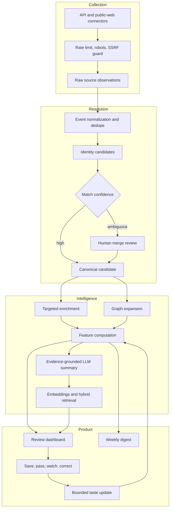

# Architecture and data flow

Unfound is an evidence pipeline with a human review loop. It is not a profile scraper and it does not treat model output as ground truth. The durable unit is an attributable **event** attached to a cautiously resolved person identity.

## North-star behavior

The system should maximize the number of previously unknown candidates who prompt meaningful follow-up per digest. Collection volume, follower count, and model confidence are supporting signals, not success metrics.

For each candidate, the product must be able to explain:

1. What new public event was observed?
2. Which identity evidence ties that event to this person?
3. Why is the event unusually strong for the candidate’s demonstrated stage?
4. Why might the candidate still be under-recognized?
5. Which independent sources and graph paths support the assessment?

## Runtime layers



## Durable data model

The foundation migration in `supabase/migrations/20260710103000_talent_radar_foundation.sql` creates a workspace-isolated model:

| Concern | Tables |
| --- | --- |
| Access and tenancy | `workspaces`, `workspace_members` |
| Source operations | `sources`, `discovery_seeds`, `ingestion_runs` |
| People and identity | `candidates`, `identities`, `identity_candidates` |
| Evidence timeline | `events`, `event_evidence` |
| Relationship graph | `graph_nodes`, `graph_edges` |
| Taste and criteria | `candidate_feedback`, `criterion_profiles` |
| Weekly delivery | `digests`, `digest_items`, `digest_subscribers` |

Candidate and event embeddings use `extensions.vector(1536)` with HNSW cosine indexes. Full-text GIN indexes support hybrid retrieval. The public RPC surface includes workspace-authorized candidate matching, hybrid search, graph neighbors, digest ranking, and dashboard metrics. `digest_subscribers` intentionally has no browser-role grant or end-user RLS policy; its email addresses are accessed only through server-authorized application routes.

Every tenant-bearing foreign key includes `workspace_id` so an accidental cross-workspace relationship fails at the database boundary. RLS and explicit grants remain required for reads and mutations.

### Collection

Each connector implements a common contract and emits normalized events, person observations, graph edges, a resumable cursor, and warnings. The shared HTTP layer enforces public HTTP(S) destinations, redirect re-validation, timeouts, response-size caps, per-origin pacing, bounded retries, and optional `robots.txt` checks.

Connectors should prefer official APIs and structured feeds. HTML extraction is an explicit source-specific fallback, never a generic unrestricted crawler. See [Connector inventory and compliance](./connectors.md).

### Event normalization and idempotency

An event records both when it happened and when Unfound discovered it:

```text
source + source external ID + event type + person external ID + occurred-at
                              |
                              v
                    deterministic event key
```

The deterministic key makes discovery runs replayable. Database uniqueness is the final concurrency guard; in-memory checks are only an optimization. Raw payloads are retained only when needed for audit or reprocessing and are subject to retention limits.

### Identity resolution

Identity resolution is deliberately conservative:

1. Exact verified provider identity, ORCID, normalized canonical URL, or privacy-preserving email hash.
2. Strong cross-source agreement across independent attributes such as affiliation, project, website, co-author, or location.
3. Fuzzy name similarity only as a candidate generator, never as sufficient merge evidence.
4. Ambiguous clusters remain separate and enter a merge-review queue.

A common name with no corroborating identifier must produce `review`, not `match`. Corrections create durable resolution evidence so the same bad merge is not recreated by a later run.

### Targeted enrichment

Broad discovery remains cheap. More expensive enrichment runs only when a candidate crosses a configurable preliminary threshold, appears near a trusted graph seed, or is explicitly watched by a reviewer.

An enrichment budget limits:

- connector requests per candidate and per origin;
- graph depth, frontier width, and repeated edges;
- LLM tokens and embedding calls;
- candidate re-enrichment frequency;
- maximum raw payload size and retention.

This staged approach spends effort where it improves a decision without turning the system into indiscriminate surveillance.

### Scoring and learned taste

The baseline score is interpretable:

```text
30% achievement quality
20% trajectory velocity
15% project originality
15% trusted-network proximity
10% evidence diversity
10% earlyness
- confidence and staleness penalties
```

Dashboard settings may change weights, minimum evidence, lookback, geography/stage preferences, graph depth, and digest size. The stored score always includes its feature vector, explanation, model/config version, and computation time.

Reviewer outcomes (`save`, `pass`, `watch`, `refer`, `interview`, `correct`) form the taste dataset. Learned updates are intentionally slow:

- fit only after a minimum volume of labeled decisions;
- cap each feature-weight movement per update window;
- preserve weight floors and a fixed exploration share;
- evaluate source, geography, institution, and graph concentration before promotion;
- retain the old configuration for audit and one-click rollback;
- never learn from protected traits or sensitive proxies.

The learner changes ranking, not facts, identity merges, or authorization.

### Graph discovery

Graph edges are evidence-backed relationships such as co-authorship, repository collaboration, contribution, competition overlap, follow, or repeated public engagement. Each edge stores direction, type, observed time, weight, and source URL.

Expansion begins from reviewer-managed seeds and applies:

- connector-specific relation weights;
- depth decay and time decay;
- caps per seed, source, and domain;
- independent-source bonuses;
- popularity penalties so the graph does not collapse onto already famous accounts;
- explicit exclusions and deletion propagation.

Graph proximity is a discovery aid. It must never be presented as endorsement or a private personal relationship.

### Summaries and embeddings

LLM output is generated from a bounded evidence packet, not an unconstrained web prompt. The packet contains canonical candidate fields, recent normalized events, graph explanations, and source URLs. The output schema separates:

- candidate summary;
- new-event summary;
- `whyNow`;
- earlyness rationale;
- confidence and unresolved identity notes;
- cited source IDs.

Reject output whose citations do not map to the evidence packet. Store prompt/model versions and regenerate summaries when material evidence changes.

Embeddings represent an evidence-grounded candidate search document containing projects, skills, research topics, achievements, career-stage evidence, and recent events. Use the same model and dimensionality for indexing and querying. Hybrid search combines vector similarity with structured filters and, where available, lexical ranking. The LLM may reformulate a user query or summarize results; it does not bypass database authorization or similarity thresholds.

### Weekly delivery

The weekly cron creates or reuses a digest keyed to the Monday 15:00 UTC window, persists the exact ranked candidate email payload on its digest items, reloads that snapshot before every delivery attempt, resolves the currently active recipients for that attempt, and calls `sendWeeklyDigest` from `lib/email`. The email layer:

- de-duplicates and deterministically sorts recipients;
- sends one isolated message per recipient in Resend batches of at most 100;
- lazily initializes Resend only in explicit send mode;
- uses deterministic batch idempotency keys;
- returns typed preview, skipped, sent, partial-failure information;
- includes source links, why-now, earlyness, and confidence in the template.

The cron persists the returned provider IDs and status. A unique digest key plus an atomic sending claim prevents concurrent weekly invocations from both sending. Failed or stale-sending attempts are automatically retryable for at most 23 hours; after that the claim fails closed because Resend idempotency expires after 24 hours. Database delivery state remains the durable duplicate-send guard.

Recipient addresses are not yet snapshotted per digest. A failed retry re-resolves active subscribers, so recipient configuration must remain stable while a digest is retryable. Add a protected digest-recipient snapshot with per-recipient delivery state before treating the cohort itself as frozen.

## Data ownership and trust boundaries

| Boundary | Allowed | Never allowed |
| --- | --- | --- |
| Browser | Publishable Supabase key, gated UI, user-entered review actions | Service-role key, connector tokens, Resend key, cron secret, dashboard password, session secret |
| Route handlers | Re-authorized request, validated input, server clients | Trusting the dashboard layout or cookie presence without verification |
| Cron handlers | `Authorization: Bearer CRON_SECRET`, idempotent reconciliation | Public invocation, stateful assumptions between serverless runs |
| Database | RLS for exposed tables, least-privilege functions, audit fields | Broad authenticated policies, public security-definer functions |
| Connectors | Public relevant evidence, permitted APIs, bounded crawling | Login bypass, private profiles, CAPTCHA evasion, unrestricted crawling |
| LLM | Cited evidence packets, structured output | Secrets, unrestricted raw personal data, authority to merge/delete/outreach |

## Failure model

- A connector failure is isolated, recorded, and does not erase other connector results.
- A run can be replayed from its stored cursor and deterministic event keys.
- An ambiguous identity does not block ingestion; it blocks automatic merge.
- A missing email key produces preview status rather than a network call.
- A missing production dashboard password or session secret denies access.
- A partial email failure returns per-batch results for reconciliation.
- A failed summary leaves source events usable and marks the summary stale.

See [Operations](./operations.md) for deployment and incident procedures.
